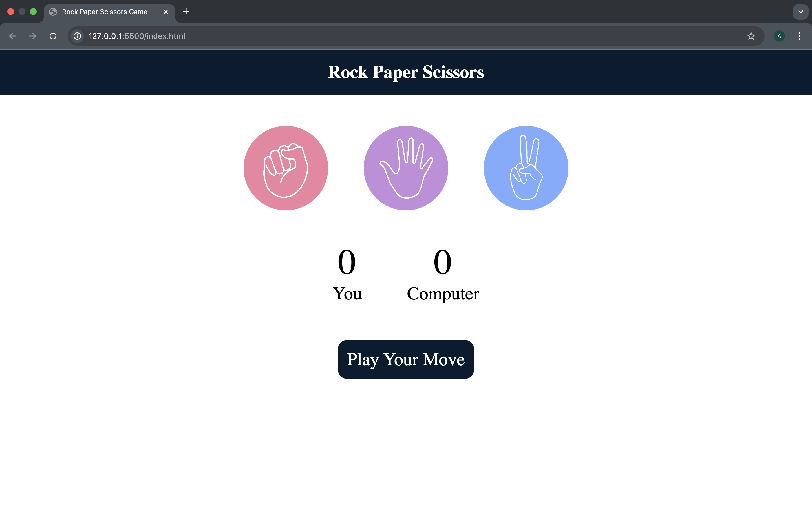
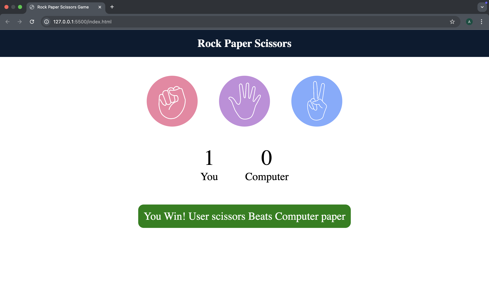
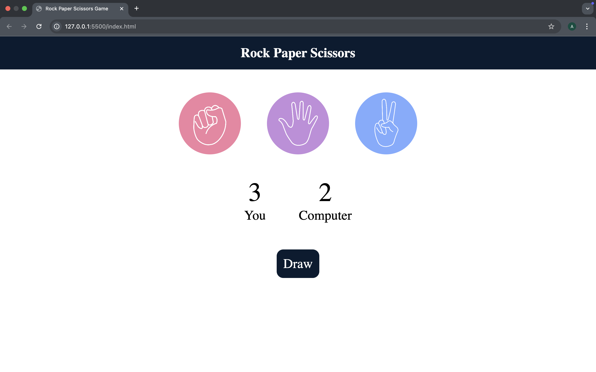

## 🪨 Rock Paper Scissors ✂️
A simple Rock-Paper-Scissors game built using HTML, CSS, and JavaScript. Play against the computer and track your score live!

## 🚀 Live Demo
Click here to play the game
(Replace the URL above with your actual GitHub Pages link)

## 📸 Screenshots

## 🛠️ Features
Interactive UI
Score tracking for user and computer
Random computer choices
Visual result feedback (win, lose, draw)

## 🧠 Logic
Rock beats Scissors
Scissors beats Paper
Paper beats Rock
Draw if both choices are the same

## 📂 Folder Structure
├── index.html
├── style.css
├── script.js
└── README.md

## 📌 How to Run Locally
Clone the repo:
git clone https://github.com/ankitkr20/Stone-Paper-Scissors.git
Open index.html in your browser.

## 🙌 Contributing
Pull requests are welcome. For major changes, please open an issue first to discuss what you’d like to change.
